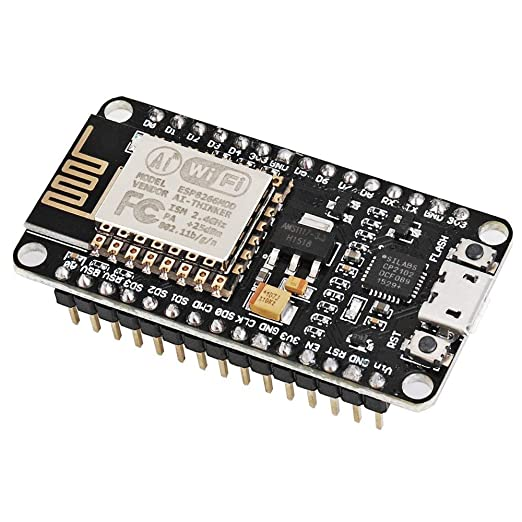
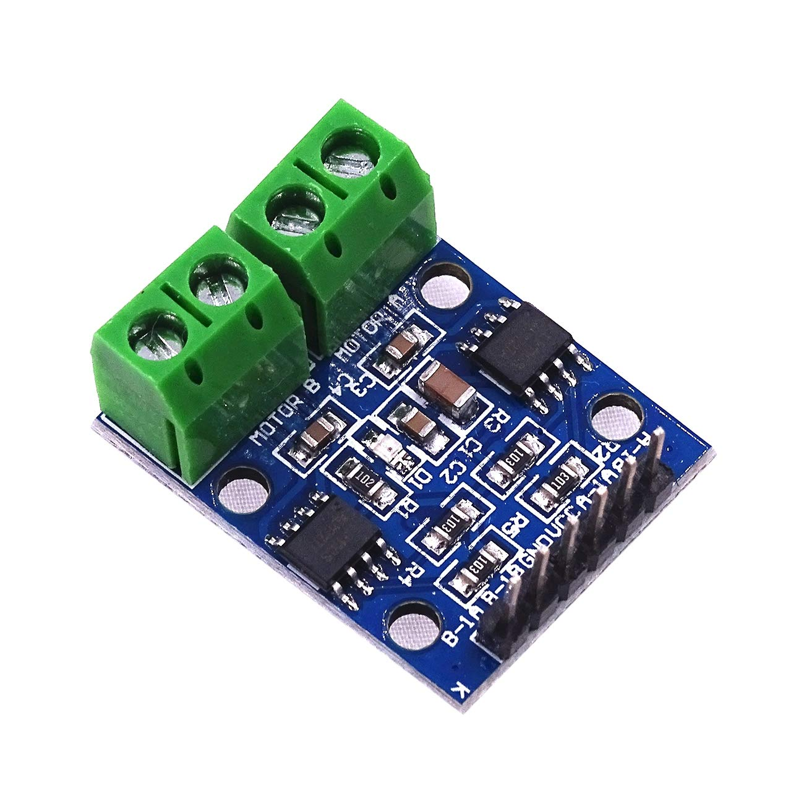
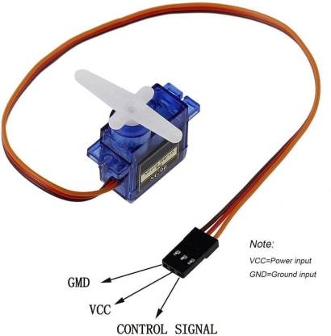

## ESP8266_Controlled_RC_car 

**A kid's toy car was modified into a dynamically controllable RC cars.**

The RC car controller microcontroller is based on  `ESP8266 NodeMCU`.

I replaced toy car's steering motor with a servo motor in order to get `full angle range of steering mode (-45degrees to +45degrees)`.

For rear motor, I used a simple tiny motor driver with varriable speed control `L9110 Board`.

Since the motor driver board is controlled by `NodeMCU`, which has compatible voltage range, it is easy for me to control speed over `NodeMCU's PWM pins`.

The power section `Vcc & Gnd` of the motor driver is directly connected to the rechargeable Ni-MH battery of `4*1.5v`, which gives the compactible power range both for motor driver and NodeMCU.

Same to the servo motor, `the servo motor` is controlled via `NodeMCU` directly and it is directly powered by the `Ni-MH` Battery not to overload the controller, in addition, the motor torque power of both servo motor and rear motor stronger.

